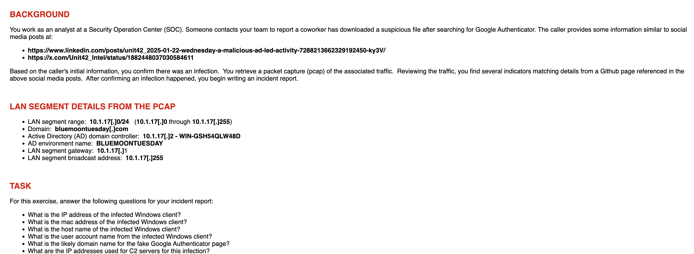
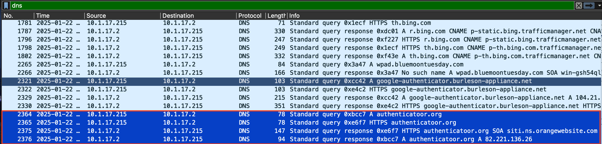
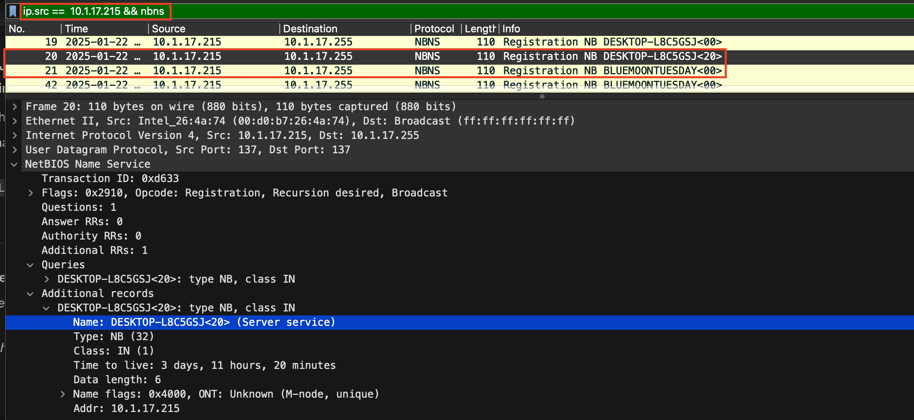
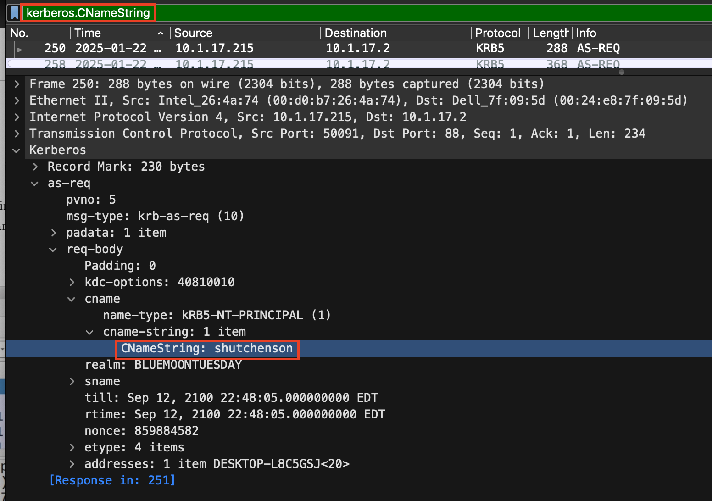
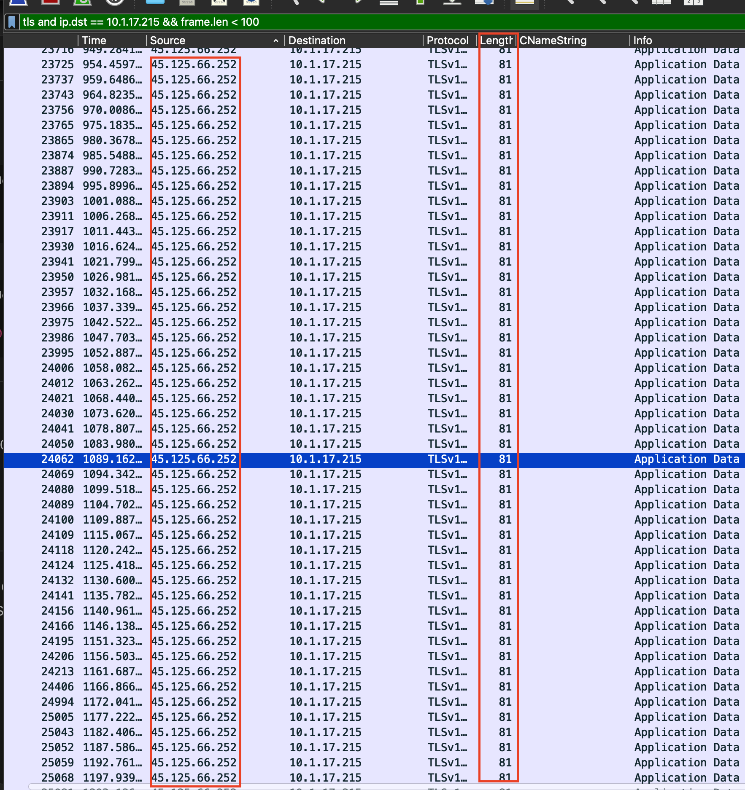

# PCAP Analysis: C2 and Suspicious Activity Investigation

## Overview
This analysis examines a PCAP file capturing network traffic from an infected host.  

**Objective:** Identify phishing activity and potential Command-and-Control (C2) servers.  
  
**Infected host IP:** `10.1.17.215`  
**Infected host MAC:** `00:d0:b7:26:4a:74`

## Lab Setup / Environment
- Tools: Wireshark `4.4.6`  
- Network briefing: `Infected client was directed to a phishing site posing as a Google authenticator site which started the infection. LAN segment range 10.1.17.0/24. Active Directory (AD) environment name: BlUEMOONTUESDAY`

*Figure 1: PCAP lab information background, details, and tasks*
## Steps Taken

### 1. Identify Infected Host
- Filtered traffic by DNS
- Looked for DNS queries to domains that may be typosquatting or impersonating well-known websites based upon the background information given
- Wireshark query used [dns]
- Found DNS queries to "authenticatoor.org" concluded that this must be the infected host (10.1.17.215)

*Figure 2: Suspicious domain found through DNS filter*

### 2. Find Info on Infected Host
- Inspected infected host to gather their domain name, MAC address, and username
- Inspected traffic of different protocols to find the necessary information
- Found domain name through NetBios Name Service (NBNS), username through Kerberos, and MAC address was found in both of these places as well.
- Wireshark queries used: [ip.src == 10.1.17.215 && nbns], [Kerberos.CnameString]

*Figure 3: Domain name of infected host found through NetBios Name Service (NBNS)*

*Figure 4: Username of infected host found through Kerberos*

### 3. Inspect Outbound Traffic for C2
- Filtered packets going to the infected host
- Applied packet size filter to highlight potential C2 traffic
- Was keeping an eye out for continous, quick, and small traffic
- Wireshark query used: "tls && ip.dst == 10.1.17.215 && frame.len < 100"

*Figure 5: Rapid small length TLS traffic from suspected C2 server*

### 4. Identify Candidate C2 Servers
- Compared suspected C2 server traffic to similar traffic from other IPs
- Found irregularities in the suspected C2 server's traffic that led me to the conclusion that it was a C2 server
- Likely C2 server identified:  
  - `45.125.66.252`

## Observations
- High-frequency TLS traffic to external server  
- Repetitive small packets, indicative of potential C2 communication  
- Connections to external domains unrelated to normal browsing  
- Indicators of compromise (IoCs) noted  

## Conclusion
- Infected host identified and monitored  
- User was directed to a fake authentication domain: `authenticatoor.org`  
- One likely C2 server detected: `45.125.66.252`  
- Pattern suggests automated communication with C2 infrastructure

## Lessons Learned / Next Steps
- There is almost always multiple ways to find a specific piece of info in a PCAP
- Always cut out as much "noise" as possible 
- Analyze logs for potential data exfiltration  
- Consider automated detection tools for C2 traffic monitoring
- Briefing mentioned multiple C2 servers, learn about C2 traffic and identify any additonal servers that contributed to C2 attack on infected host
